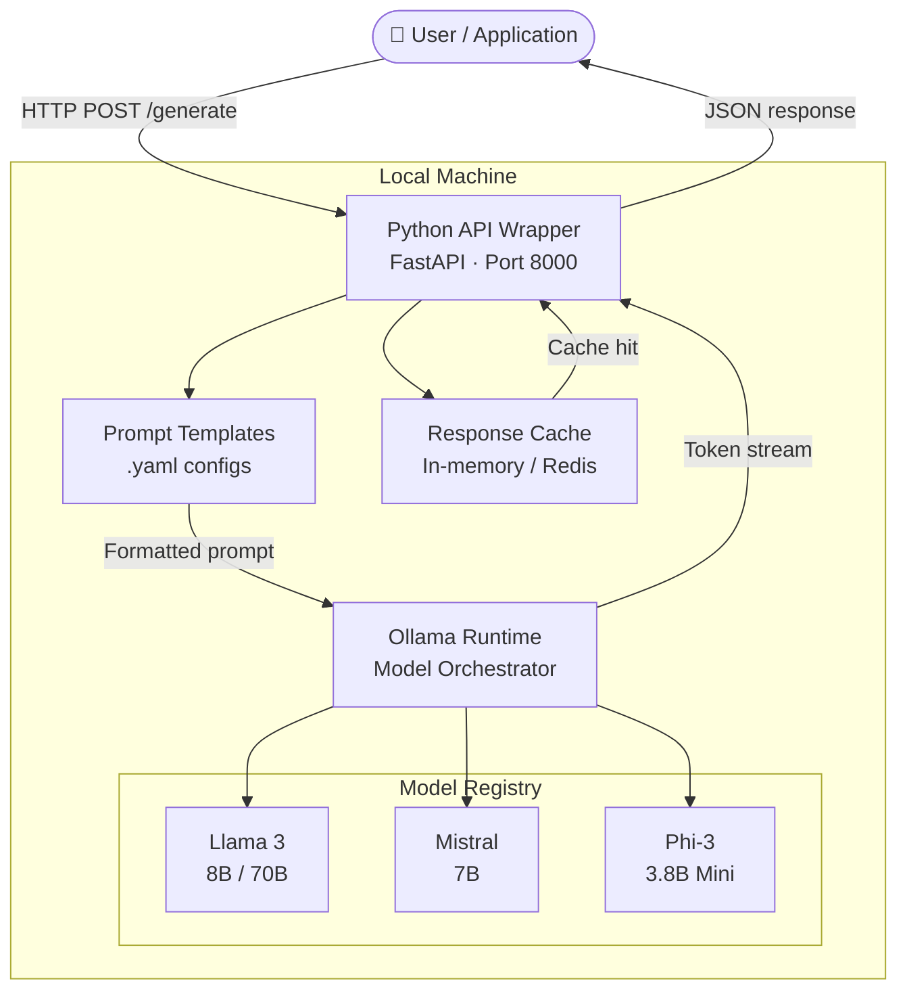

# 🤖 AI Capability — Local LLM Deployment

> Run open-source large language models locally in under 10 minutes. No GPU required, no cloud costs, full privacy.

[](https://python.org)
[](https://ollama.ai)
[](LICENSE)
[](https://gurur.me)

---

## Overview

This project demonstrates how to deploy and run open-source LLMs (Llama 3, Mistral, Phi-3) entirely on local hardware using [Ollama](https://ollama.ai) as the inference runtime. It includes a lightweight Python API wrapper, prompt templates for common use cases, and benchmarks comparing models on CPU vs GPU.

**Why run LLMs locally?**
- Zero API costs — no usage bills
- Full data privacy — nothing leaves your machine
- No internet dependency — works offline
- Experiment freely without rate limits

---

## Architecture



---

## Quick Start

### Prerequisites

- macOS, Linux, or Windows (WSL2)
- Python 3.10+
- 8 GB RAM minimum (16 GB recommended for 7B+ models)
- [Ollama](https://ollama.ai/download) installed

### 1. Install Ollama

```bash
# macOS / Linux
curl -fsSL https://ollama.ai/install.sh | sh

# Verify
ollama --version
```

### 2. Pull a model

```bash
# Llama 3 (8B) — best balance of speed and quality
ollama pull llama3

# Mistral 7B — great for coding tasks
ollama pull mistral

# Phi-3 Mini — fastest, lowest RAM (3.8B)
ollama pull phi3
```

### 3. Clone this repo and install dependencies

```bash
git clone https://github.com/guppikan/AI-Capability.git
cd AI-Capability

pip install -r requirements.txt
```

### 4. Run the API server

```bash
python api.py
# → Listening on http://localhost:8000
```

### 5. Send your first request

```bash
curl -X POST http://localhost:8000/generate \
  -H "Content-Type: application/json" \
  -d '{"model": "llama3", "prompt": "Explain AWS Lambda in one paragraph."}'
```

---

## Model Benchmarks

Performance measured on an Apple M2 Pro (16 GB RAM), CPU-only inference:

| Model | Size | RAM Usage | Tokens/sec | Time to first token |
|---|---|---|---|---|
| Phi-3 Mini | 3.8B | ~3.5 GB | ~28 t/s | ~1.2s |
| Mistral 7B | 7B | ~5.1 GB | ~18 t/s | ~2.1s |
| Llama 3 8B | 8B | ~6.0 GB | ~15 t/s | ~2.8s |
| Llama 3 70B (Q4) | 70B | ~42 GB | ~3 t/s | ~8s |

> All models use 4-bit quantisation (Q4_K_M) for optimal speed/quality tradeoff.

---

## Project Structure

```
AI-Capability/
├── api.py                  # FastAPI wrapper around Ollama
├── requirements.txt
├── prompts/
│   ├── code_review.yaml    # Prompt template: code review
│   ├── summarise.yaml      # Prompt template: document summarisation
│   └── qa.yaml             # Prompt template: Q&A with context
├── benchmarks/
│   └── run_benchmark.py    # Benchmark script across models
└── examples/
    ├── basic_chat.py       # Simple chat example
    └── rag_example.py      # Retrieval-augmented generation demo
```

---

## API Reference

### `POST /generate`

```json
{
  "model": "llama3",
  "prompt": "Your prompt here",
  "template": "code_review",
  "stream": false,
  "options": {
    "temperature": 0.7,
    "max_tokens": 512
  }
}
```

**Response:**
```json
{
  "model": "llama3",
  "response": "...",
  "tokens_generated": 143,
  "duration_ms": 4823
}
```

### `GET /models`

Returns a list of locally available models.

### `GET /health`

Health check endpoint.

---

## Use Cases

- **Private document Q&A** — Ask questions over internal docs without sending data to a cloud API
- **Code review assistant** — Review PRs locally with zero latency
- **Offline chatbot** — Run a chatbot in environments with no internet access
- **LLM prototyping** — Rapidly test prompts and model behaviour before committing to a hosted API

---

## Roadmap

- [ ] Add streaming response support
- [ ] RAG pipeline with local vector store (ChromaDB)
- [ ] Web UI (Gradio or Streamlit)
- [ ] Docker Compose setup for easy deployment
- [ ] Support for multi-modal models (LLaVA)

---

## Author

**Guru Prasad Raju** · Cloud Automation Engineer · Sydney, AU
[gurur.me](https://gurur.me) · [LinkedIn](https://www.linkedin.com/in/guru-prasad-raju) · [GitHub](https://github.com/guppikan)

---

## License

MIT — see [LICENSE](LICENSE) for details.
